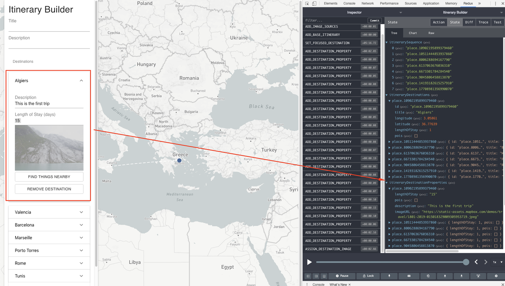
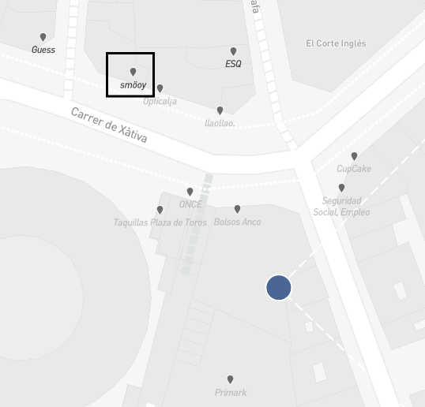
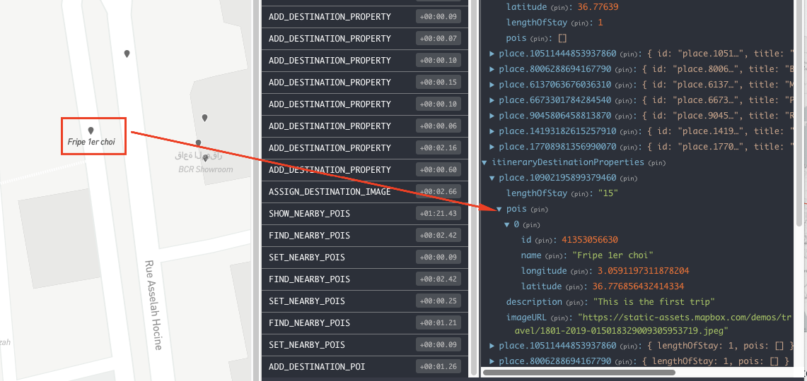
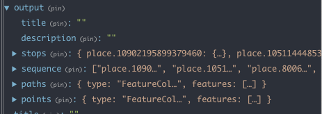

# Consumer Workflows: Itinerary Builder

This repository contains the source code for the Mapbox Itinerary Builder. The core use-case is a fictional travel company looking to build an application for vacation planning. This solution includes the following functionality:

1. Authoring environment for building the itinerary and adding custom metadata like points of interest, descriptions, and imagery.
2. Maps for visualizing stops and points-of-interest
3. Geocoding from CSV to plot the draft itinerary
4. Search for points-of-interest, powered by Mapbox Tilequery API
5. Display enviroment for publishing the completed itinerary

This workflow contains sample data, but individual datasets can be imported into the **Authoring** environment and edited at will.

This workflow generates an interactive website with the completed itinerary, but this can be adapted to upload to external storage (such as S3 or any database), save to a local file, or generate a static image for print.

## Organization

This project has two main sections:

[**Authoring**](src/authoring/components/Authoring.tsx). The authoring page presents a user interface for adding data to a map.

[**Display**](src/display/components/Display.tsx). The display page shows the "published" data on a map and supports standard user interactions.

### Author Experience

When a user updates source data (via CSV) or metadata (in Authoring Environment), this dispatches events that trigger [application state](src/authoring/data/AuthorState.ts) changes. These events can be tracked in the [Redux dev tools](https://github.com/reduxjs/redux-devtools).

Async updates, such as geocoding and file loading, are handled through [Sagas](https://redux-saga.js.org/). Sagas provide a runtime for generator functions to handle events, wait for asynchronous actions to complete, and dispatch new events with the results of those actions.

Once the authoring data has been updated, it can be exported into the **Display** environment. This is handled via an event that populates the `output` property of the application state. `output` stores a read-friendly version of the edit-friendly authoring data.

### Display Experience

Once `output` is populated, the `/display` route becomes available. This will render your published itinerary in a more shareable static format.

## Building and running

To use Mapbox services, you need to set your access token. You can get an access token from your [Mapbox account](https://account.mapbox.com/). If you don't have an account yet, you can sign up and get started for free.

Copy your token then set it in your environment, using one of the two methods below:

1) Set the value of the `REACT_APP_MAPBOX_API_KEY` variable in [.env](./.env).
2) Set the value of `REACT_APP_MAPBOX_API_KEY` as an environment variable in your terminal.

With the token set, run the following:

```bash
yarn install
yarn start
```

This solution was bootstrapped with [Create React App](https://github.com/facebook/create-react-app). Consult that project's documentation specific questions related to code organization, scripts, and deployments.

### Application State

All user interactions with the **Authoring** environment is captured via Redux. Redux DevTools can help you track this data and the users individual interactions.



The user is presented with multiple manual input options (Description, Length of Stay, Imagery) for manual input. Selecting `Find Things Nearby` will trigger a call to the Mapbox Tilequery API, which populates POIs around the location. These can be individually selected to add to the itinerary. See sample visual results below:



Redux will capture all POI metadata initially, but **Display** will only list out the POI Names.



Once annotations are completed, this information will be added into the `output` state for creation of the Display environment. This JSON representation can also be captured for external usage.



## Available Scripts

In the project directory, you can run:

### `yarn start`

Runs the app in the development mode.

Open [http://localhost:3000](http://localhost:3000) to view it in the browser.

The page will reload if you make edits. You will also see any lint errors in the console.

### `yarn run build`

Builds the app for production to the `build` folder. It correctly bundles React in production mode and optimizes the build for optimal performance. The build is minified and the filenames include the hashes.

For deployment to hosting providers, see Create React App's [deployment section](https://facebook.github.io/create-react-app/docs/deployment) for more information.
